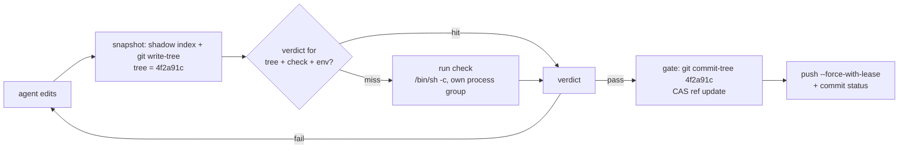

<p align="center">
  
</p>

<h1 align="center">greentree</h1>

<p align="center"><b>Test the tree, not every commit.</b></p>

<p align="center">
greentree content-addresses your dirty working tree, caches check verdicts by tree hash,<br>
and refuses to create a commit from any tree that has not passed.
</p>

<p align="center">
An open source primitive from <a href="https://reachpad.dev">reachpad</a> · Apache-2.0 · Linux and macOS
</p>

---

```console
$ greentree test
tree 8be03d1  test ✗ (11.2s)          # attempt 1: red

$ greentree test                       # attempt 2, after edits
tree 4f2a91c  test ✓ (10.8s)

$ greentree test                       # attempt 3 reverted attempt 2's edit
tree 4f2a91c  test ✓ (cached)          # same content, same tree, no re-run

$ greentree gate -m "implement add()"
  test ✓ (cached)
published commit a1c4e77 from verified tree 4f2a91c on main
```

The published commit is built with `git commit-tree` from the exact tree
object the checks passed against. Not a re-checkout, not a re-run. What was
tested is what ships, byte for byte.

## The problem

A coding agent makes 30 attempts at a change inside a workspace. The
verification loop for those attempts lives on the wrong side of the push:

1. The agent thinks it is done and commits.
2. It pushes. CI queues, boots a cold runner, reinstalls dependencies, and
   runs the full suite against a commit SHA.
3. Fifteen minutes later a red X arrives on a commit the agent has already
   moved past.
4. A reviewer comments. The agent starts a new environment, reproduces the
   state, edits, and the cycle repeats from step 1.

Every step re-derives state the workspace already had: the checkout, the
warm caches, the running services, the test results for content that did
not change. CI verifies commits; agents produce dozens of candidate
*trees* per commit that lands.

greentree moves verification inside the workspace and makes the tree, not
the commit, the unit of proof:

- **A test result belongs to a tree hash.** Revert an experiment and the
  previous verdict is valid again, instantly. Rerun nothing that already
  passed on identical content.
- **Publishing is a gate, not a reminder.** `greentree publish` exits 11
  unless the current tree has a passing, fresh verdict for every required
  check. There is no "pushed before the tests finished".
- **One idempotent verb for agents.** `greentree gate` runs whatever is
  not cached, then publishes if green. Safe to call in a loop.

## How it works



1. **Snapshot.** A persistent shadow index (never your real index, so there
   is no `index.lock` contention with your own git usage) is refreshed with
   `git add -A` and hashed with `git write-tree`. Cost is O(changed files)
   after the first run: 4 git subprocesses on a warm cache hit. The
   snapshot captures tracked files plus untracked files not ignored by
   `.gitignore`, minus configured excludes.
2. **Verdict cache.** Results are keyed by
   `(tree, check, command hash, environment fingerprint)`. Only `pass` and
   `fail` enter the cache. Timeouts, infrastructure errors, and runs during
   which the tree changed are never cached: a verdict that binds to no
   exact tree is worthless.
3. **Publish.** `git commit-tree <verified-tree>`, a compare-and-swap ref
   update, and (with `--push`) a push whose `--force-with-lease` expectation
   is recorded explicitly. Every step is journaled: a publish killed at any
   point resumes exactly where it stopped, and the verification gate runs
   again on resume. Every commit carries a `Greentree-Change-Id` trailer,
   the stable identity that will let stacks of verified changes survive
   rebases (see the [roadmap](docs/ROADMAP.md)).
4. **Statuses.** With a GitHub token in the environment, a pushed publish
   posts a `greentree/<check>` commit status on the new SHA. Statuses
   satisfy branch protection required checks.

## Install

```sh
cargo install --git https://github.com/reachpad/greentree
```

`--no-default-features` builds without the GitHub status client and its
TLS stack. Prebuilt binaries are on the [roadmap](docs/ROADMAP.md).

## Quickstart

```sh
cd your-repo
greentree init      # detects pnpm/npm/yarn/cargo/go/uv, writes greentree.yaml
greentree test      # snapshot + run checks; instant when the tree is known
greentree gate      # verify (cache-aware), then commit the verified tree
greentree watch     # run watch-marked checks whenever the tree settles
```

No config file? `greentree test` auto-detects the project type and runs
its conventional test command.

## Capabilities

### Commands

| command | what it does |
|---|---|
| `init` | Detects the project, writes `greentree.yaml`, warms the snapshot index |
| `test [check]` | Snapshots the tree and runs checks; cache hit = no process runs |
| `status` | Reports the current tree, its verdicts, and whether publish would succeed |
| `publish` | Creates a commit from the current tree; exit 11 unless verified |
| `gate` | `test` for required checks, then `publish` if green; idempotent |
| `watch` | Reruns watch-marked checks on every settle; kills runs on edit |
| `gc` | Prunes snapshot anchors and trims logs |

Every command takes `--json` (exactly one JSON object on stdout) and
`-C <dir>`. Exit codes are a stable contract:

| exit | meaning |
|---|---|
| 0 | success: checks green, published, or no-op |
| 10 | a check ran and failed |
| 11 | publish refused: tree not verified |
| 12 | unsnapshotable state: mid-merge, conflicted index, dirty submodule |
| 13 | another greentree process holds the lock |
| 14 | configuration error |
| 15 | publish machinery failed: CAS refused, push rejected, no remote |

Full JSON shapes and the verdict record schema are in
[docs/SPEC.md](docs/SPEC.md).

### Configuration

```yaml
version: 1

checks:
  quick:
    run: pnpm lint && pnpm test
    watch: true          # run from `greentree watch` on each settle
  full:
    run: pnpm test && pnpm build
    required_for_publish: true
    fresh: 30m           # a pass older than this will not satisfy the gate
    timeout: 20m         # default 15m; SIGTERM, 5s grace, SIGKILL

snapshot:
  exclude: ["docs/generated/**"]   # paths checks may write without
                                   # invalidating their own verdict

inputs: [".env", "pnpm-lock.yaml"] # gitignored files that affect results:
                                   # hashed per-file into the verdict key,
                                   # so a cache miss names the file that
                                   # caused it
```

### The watch loop

`greentree watch` runs `watch: true` checks whenever the tree settles.
Two policies make it agent-proof:

- **Kill on edit.** A file mutation during a run kills the check's whole
  process group immediately. The result could never be cached (it binds to
  no tree), and the CPU belongs to the agent's next attempt.
- **Adaptive settle window.** 300ms, doubling after each cancelled cycle,
  capped at 5s. A continuously editing agent cannot starve verification,
  and a cancelled cycle reruns even if no further edit arrives.

The lock is held only during a cycle, so `test` and `gate` interleave
freely with a running watcher.

### Isolation and safety

- Checks run under `/bin/sh -c` in their own process group with `GIT_*`
  redirection variables scrubbed: a `git` command inside your test suite
  sees your real repo, never greentree's shadow index.
- greentree never writes your index, your worktree, or your refs outside
  `refs/greentree/*`, except at publish, where the ref move is a
  compare-and-swap and the push records its lease explicitly.
- Every tree a check ran against is anchored at
  `refs/greentree/snapshots/<sha>`, so the exact tested state can be
  diffed or restored later. `gc` bounds the accumulation.
- Logs stream to `.git/greentree/logs/` with a size cap and a digest
  computed over the full stream.

### For coding agents

The agent-facing contract is one verb and one exit-code table:

```sh
greentree gate --json -m "<message>"
```

[docs/AGENTS.md](docs/AGENTS.md) has the copy-paste project-instructions
snippet and a Claude Code hook that blocks `git commit`/`git push` so the
gate is the only door.

### In CI

The composite action restores `.git/greentree` from the actions cache and
runs `greentree test --json`. A commit whose tree was already verified
costs nothing; changed content genuinely re-runs.

```yaml
- uses: actions/checkout@v4
- uses: reachpad/greentree/action@main
  # with:
  #   fresh: "true"   # distrust restored verdicts; always re-run
```

## Comparisons

| | unit of proof | runs | revert costs | rebase (same content) costs |
|---|---|---|---|---|
| **greentree** | tree (content) | before the push, in your warm workspace | nothing: cache hit | nothing: same trees |
| CI (Actions etc.) | commit SHA | after the push, cold runner | full re-run | full re-run |
| git-test | commit's tree | on existing commits | cache hit | cache hit |
| pre-commit / husky | none (hooks) | at every commit | full re-run | full re-run |
| Jujutsu | none | never (no test runner) | n/a | n/a |
| Graphite + CI | commit SHA per branch | after every restack force-push | full re-run | full stack re-run |
| Turborepo / Nx / Bazel | task inputs | wherever invoked | task-level hit | task-level hit |

**CI.** Runs after the push, once per commit SHA, on a runner that starts
from nothing. greentree runs before the push, in the workspace that
already has the checkout, the dependency caches, and the services, and
never re-runs a check whose exact content already passed. CI stays the
authoritative re-check; greentree makes it arrive green.

**git-test** ([mhagger/git-test](https://github.com/mhagger/git-test)) is
the closest prior art and also caches results by tree. It tests ranges of
existing commits; greentree tests the dirty tree before any commit exists,
adds the environment fingerprint to the key, and gates publishing on the
result. Same insight, opposite end of the commit's lifecycle.

**pre-commit / husky.** Hooks re-run on every commit regardless of
content, slow the honest path, and are one `--no-verify` away from not
existing. greentree memoizes by content and creates the commit itself, so
there is no hook to skip. It also bypasses commit hooks by construction;
its checks are the hook.

**Jujutsu** snapshots the working copy as a commit automatically, which is
the same primitive greentree builds on, and its stable change IDs inspired
the `Greentree-Change-Id` trailer. jj has no verdict cache and no publish
gate; it manages history, not verification. greentree stays plain git, so
every agent's existing tooling works unchanged. Running jj colocated on
the same repo does not break greentree.

**Graphite and stacked-PR tools** re-push a stack of branches on every
restack; CI, keyed by SHA, re-runs everything, and Graphite sells
heuristics to suppress those runs. Tree-keyed verdicts make the same
optimization exact rather than heuristic: a message edit or reorder keeps
every tree and re-verifies nothing, and levels below an edit never re-run.
Stack support is [planned](docs/ROADMAP.md) on the trailer already present
in every published commit.

**Build caches (Turborepo, Nx, Bazel).** They memoize *task* results
keyed by declared task inputs, inside the build graph. greentree memoizes
*whole-tree* verdicts and controls what becomes a commit. They compose:
`run: turbo test` gives task-level incrementality inside a run and
tree-level memoization across runs.

**Merge queues** synthesize their own commits after approval, which no
pre-push verifier can see. Out of scope; documented in the spec.

## Limitations

Stated here because a verification tool that oversells is worse than none:

- The verdict cache is machine-local and advisory. It attests that this
  tree passed on this machine, not a tamper-proof supply chain proof.
- `run:` commands come from repo config and execute with your privileges,
  the same trust model as `npm test` or `make`.
- Undeclared environment (toolchain versions, system libraries) is not in
  the verdict key. Declare what matters in `inputs:`.
- An edit-and-revert during a single check run (ABA) is undetectable until
  the worktree executor lands (v0.4); watch narrows the window by killing
  on the first edit.
- Dirty submodules are refused (exit 12): their state is invisible to the
  superproject tree hash. Symlink targets outside the repo are not
  captured.
- Windows is unsupported for now.

## Roadmap

v0.4 materializes any tree into an ephemeral worktree for verification,
v0.5 builds stacks on the change-id trailer, v0.6 projects stacks onto
GitHub PRs, v0.7 adds the GitHub App with real check runs and
review-comment routing back to the workspace. Details and explicit
non-goals: [docs/ROADMAP.md](docs/ROADMAP.md).

## License

Apache-2.0. Built by [reachpad](https://reachpad.dev), infrastructure for
coding agents.
